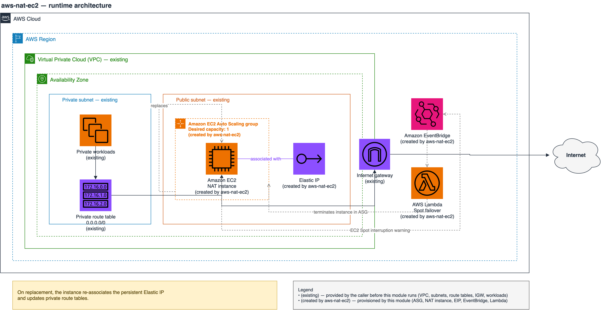

# aws-nat-ec2

A self-hosted, Spot-capable, AL2023-based NAT instance — a cheaper
alternative to AWS Managed NAT Gateway for outbound-only internet access
from private subnets. One module call provisions exactly one NAT
instance (via an Auto Scaling Group) and one persistent Elastic IP in a
single Availability Zone; call the module once per AZ that needs NAT
egress.

Highlights:

- AL2023, resolved via the public SSM AMI parameter — no custom AMI.
- Spot capacity by default, with reactive (ASG replacement) and
  proactive (Spot-interruption-warning → Lambda) failover.
- The public IP stays the same across every instance replacement.
- SSM Session Manager only — no SSH, no key pairs, no bastion host.

See [SPEC.md](SPEC.md) for the full design rationale, the complete
input/output reference (§7.1/§7.2), IAM permissions (§7.3), and the
runnable manual verification plan (§13).

## Architecture



Editable source: [`docs/architecture.excalidraw`](docs/architecture.excalidraw)
— open it at [excalidraw.com](https://excalidraw.com) (menu → Open) or in
the Excalidraw VS Code/desktop app.

## Requirements

| Name | Version |
|---|---|
| terraform | >= 1.9 |
| aws provider | ~> 6.0 |
| archive provider | ~> 2.4 |

This module has no `provider` block of its own (standard reusable-module
convention) — the caller's Terragrunt/root-module configuration supplies
AWS credentials and region.

## Usage (Terragrunt)

The module never creates VPC/subnet/route-table topology — it consumes
an existing public subnet (for the NAT instance) and existing private
route table(s) to repoint at it. A minimal `terragrunt.hcl`:

```hcl
terraform {
  # Replace with wherever this module actually lives — a git URL
  # (e.g. "git::https://github.com/<org>/<repo>.git//?ref=v1.0.0"), a
  # relative local path, or a Terraform registry source.
  source = "<path-or-git-url-to-this-module>"
}

dependency "vpc" {
  config_path = "../vpc"
}

dependency "subnets" {
  config_path = "../subnets"
}

inputs = {
  name_prefix             = "myapp-dev"
  vpc_id                  = dependency.vpc.outputs.vpc_id
  public_subnet_id        = dependency.subnets.outputs.public_subnet_ids[0]
  private_route_table_ids = [dependency.subnets.outputs.private_route_table_ids[0]]

  # Optional — shown at their defaults for clarity; omit any of these
  # to use the default. See SPEC.md §7.1 for the full list.
  architecture        = "x86_64" # or "arm64"
  use_spot            = true
  allow_inbound_cidrs = []
  tags = {
    environment = "dev"
  }
}
```

For a second AZ, add a second Terragrunt unit calling this same module
with that AZ's `public_subnet_id`/`private_route_table_ids` — this
module deliberately has no multi-AZ logic of its own (SPEC §3/§4.1).

## Inputs and outputs

Full tables, with types, defaults, and descriptions: [SPEC.md §7.1
(Inputs)](SPEC.md#71-inputs) and [SPEC.md §7.2
(Outputs)](SPEC.md#72-outputs). Not duplicated here to avoid the two
copies drifting out of sync — SPEC.md is the source of truth.

At minimum, every module call must supply `name_prefix`, `vpc_id`,
`public_subnet_id`, and `private_route_table_ids`; everything else has a
sensible default.
