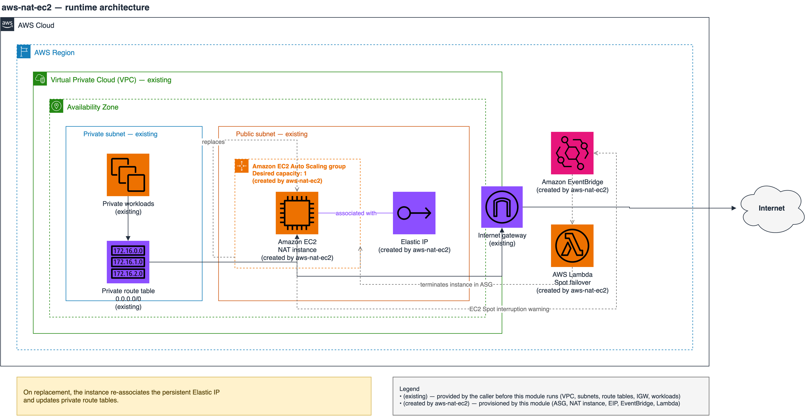

# aws-nat-ec2

A self-hosted, Spot-capable, AL2023-based NAT instance — a cheaper
alternative to AWS Managed NAT Gateway for outbound-only internet access
from private subnets. One module call provisions exactly one NAT
instance (via an Auto Scaling Group) and one persistent Elastic IP in a
single Availability Zone; call the module once per AZ that needs NAT
egress.

Highlights:

- AL2023, resolved via the public SSM AMI parameter — no custom AMI.
- Spot capacity by default, with reactive (ASG replacement) and
  proactive (Spot-interruption-warning → Lambda) failover.
- Spot exhaustion fallback: CloudWatch alarm + Lambda flips the ASG to
  On-Demand when zero instances stay InService (SPEC §5.4).
- Optional SNS notifications (BYO topic) for reactive/proactive
  failover and Lambda error/throttle backstop alarms — opt-in, nothing
  created when `sns_topic_arn` is unset.
- The public IP stays the same across every instance replacement.
- SSM Session Manager only — no SSH, no key pairs, no bastion host.

Inputs and outputs are documented below. See [SPEC.md](docs/SPEC.md) for the
full design rationale, IAM permissions (§7.3), and the runnable manual
verification plan (§13).

## Architecture



Editable source: [`docs/architecture.drawio`](docs/architecture.drawio)
— open it at [diagrams.net](https://app.diagrams.net) (File → Open From
→ Device) or in the draw.io VS Code/desktop app.

## Requirements

| Name | Version |
|---|---|
| terraform | >= 1.9 |
| aws provider | ~> 6.0 |
| archive provider | ~> 2.4 |

This module has no `provider` block of its own (standard reusable-module
convention) — the caller's Terragrunt/root-module configuration supplies
AWS credentials and region.

## Usage (Terragrunt)

The module never creates VPC/subnet/route-table topology — it consumes
an existing public subnet (for the NAT instance) and existing private
route table(s) to repoint at it. A minimal `terragrunt.hcl`:

```hcl
terraform {
  # Replace with wherever this module actually lives — a git URL
  # (e.g. "git::https://github.com/<org>/<repo>.git//?ref=v1.0.0"), a
  # relative local path, or a Terraform registry source.
  source = "<path-or-git-url-to-this-module>"
}

dependency "vpc" {
  config_path = "../vpc"
}

dependency "subnets" {
  config_path = "../subnets"
}

inputs = {
  name_prefix             = "myapp-dev"
  vpc_id                  = dependency.vpc.outputs.vpc_id
  public_subnet_id        = dependency.subnets.outputs.public_subnet_ids[0]
  private_route_table_ids = [dependency.subnets.outputs.private_route_table_ids[0]]

  # Optional — shown at their defaults for clarity; omit any of these
  # to use the default. See the Inputs table below for the full list.
  architecture        = "x86_64" # or "arm64"
  use_spot            = true
  allow_inbound_cidrs = []
  tags = {
    environment = "dev"
  }
}
```

For a second AZ, add a second Terragrunt unit calling this same module
with that AZ's `public_subnet_id`/`private_route_table_ids` and a
**distinct `name_prefix`** — this module deliberately has no multi-AZ
logic of its own (SPEC §3/§4.1). `name_prefix` must be unique per
module call: unlike the ASG/IAM role/EventBridge rule (which get
Terraform's own randomized `name_prefix` suffix), the Lambda function
names, CloudWatch Log Group names, and CloudWatch alarm names are
derived directly from it with no added uniqueness, so two calls
sharing the same value collide on those resources.

## Inputs

At minimum, every module call must supply `name_prefix`, `vpc_id`,
`public_subnet_id`, and `private_route_table_ids`; everything else has a
sensible default.

| Variable | Type | Default | Description |
|---|---|---|---|
| `name_prefix` | `string` | — (required) | Prefix for resource names and tags. Must be 20 characters or fewer (validated) — combined with this module's own resource-name suffixes and Terraform's `name_prefix` random suffix, a longer value can exceed AWS's 64-character limit on EventBridge rule / IAM role names. **Must also be unique per module call** (e.g. per AZ): the Lambda function, CloudWatch Log Group, and CloudWatch alarm names are derived directly from it with no added uniqueness, unlike the ASG/IAM role/EventBridge rule. |
| `vpc_id` | `string` | — (required) | Existing VPC ID. |
| `public_subnet_id` | `string` | — (required) | Existing public subnet the NAT instance runs in. AZ is derived from this subnet. |
| `private_route_table_ids` | `list(string)` | — (required) | Route table IDs to repoint at the active NAT instance. |
| `architecture` | `string` | `"x86_64"` | `"x86_64"` or `"arm64"`. Drives AMI SSM parameter and default instance types. |
| `instance_types` | `list(string)` | arch-based default (e.g. `["t3a.nano","t3.nano"]` or `["t4g.nano"]`) | Candidate instance types for the ASG mixed-instances policy. |
| `root_volume_size` | `number` | `8` | Root EBS volume size (GB), 8-100 (validated). |
| `root_volume_kms_key_id` | `optional(string)` | `null` | Optional customer-managed KMS key ARN/ID for root volume encryption. If `null`, the account's default `aws/ebs` key is used (no extra setup needed). **If you supply a customer-managed key, its key policy must separately authorize the `AWSServiceRoleForAutoScaling` service-linked role** — the ASG launches the encrypted volume, not you directly, and that role has no access to customer-managed keys by default (only to the account's own `aws/ebs` key). Add two statements to the key's policy for principal `arn:aws:iam::<account-id>:role/aws-service-role/autoscaling.amazonaws.com/AWSServiceRoleForAutoScaling`: one allowing `kms:Encrypt`, `kms:Decrypt`, `kms:ReEncrypt*`, `kms:GenerateDataKey*`, `kms:DescribeKey`; another allowing `kms:CreateGrant` with condition `kms:GrantIsForAWSResource: true`. Without both, instance launches fail. See [AWS's own key policy requirements doc](https://docs.aws.amazon.com/autoscaling/ec2/userguide/key-policy-requirements-EBS-encryption.html) for the full example. |
| `use_spot` | `bool` | `true` | Whether to prefer Spot capacity. |
| `spot_on_demand_fallback` | `bool` | `true` | When `use_spot` is true, flip to 100% On-Demand via alarm + Lambda if zero instances stay InService (Spot exhaustion). Ignored when `use_spot` is false. |
| `spot_fallback_alarm_period_seconds` | `number` | `120` | CloudWatch alarm period for Spot-exhaustion fallback. |
| `spot_fallback_alarm_evaluation_periods` | `number` | `2` | Consecutive breaching periods before fallback runs. |
| `eip_allocation_id` | `optional(string)` | `null` | Bring-your-own EIP allocation ID. If `null`, the module allocates a new EIP. |
| `release_eip_on_destroy` | `bool` | `true` | **Documentation-only — has no Terraform-enforced effect.** `lifecycle` meta-arguments can't reference variables, so no resource reads this value; a normal `terraform destroy` always releases the module-allocated EIP regardless of what it's set to. To actually preserve the EIP across a destroy, run `terraform state rm '<module address>.aws_eip.nat[0]'` before destroying — it becomes unmanaged and must be reimported or released manually afterward. Ignored if `eip_allocation_id` is supplied (caller owns lifecycle). See SPEC.md §10. |
| `allow_inbound_cidrs` | `list(string)` | `[]` | Optional additional ingress CIDRs on the NAT security group, beyond the default (no inbound from the internet). |
| `tags` | `map(string)` | `{}` | Additional tags applied to all resources. |
| `sns_topic_arn` | `optional(string)` | `null` | Bring-your-own SNS topic ARN for failover/health notifications. If `null`, no notifications are sent and the module creates no SNS resources. |
| `log_retention_days` | `number` | `14` | Retention (days) for both Lambdas' CloudWatch Log Groups. Must be one of CloudWatch Logs' accepted `retention_in_days` values (validated). |

## Outputs

| Output | Description |
|---|---|
| `nat_instance_asg_name` | Name of the Auto Scaling Group. |
| `nat_instance_security_group_id` | Security Group ID attached to the NAT instance. |
| `eip_public_ip` | The persistent public IP address. |
| `eip_allocation_id` | Allocation ID of the EIP in use (module-created or BYO passthrough). |
| `iam_role_arn` | ARN of the NAT instance's IAM role. |
| `failover_lambda_arn` | ARN of the proactive-failover Lambda function. |
| `eventbridge_rule_arn` | ARN of the Spot-interruption-warning EventBridge rule. |
| `spot_fallback_lambda_arn` | ARN of the Spot-exhaustion fallback Lambda (`null` when fallback is disabled). |
| `spot_fallback_alarm_arn` | ARN of the CloudWatch alarm for Spot-exhaustion fallback (`null` when disabled). |

**Note:** if the fallback Lambda flips the live ASG to On-Demand at
runtime, Terraform state still shows Spot-only until you apply a config
change. To persist On-Demand after fallback, set `use_spot = false` and
apply. A blind `terraform apply` with `use_spot = true` resets the ASG
back to Spot-only.

## Inspiration

This module took inspiration from:

- [int128/terraform-aws-nat-instance](https://github.com/int128/terraform-aws-nat-instance) (archived)
- [AndrewGuenther/fck-nat](https://github.com/AndrewGuenther/fck-nat)
